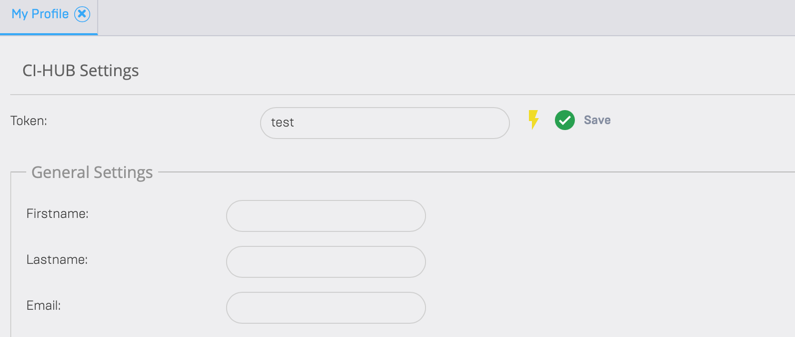
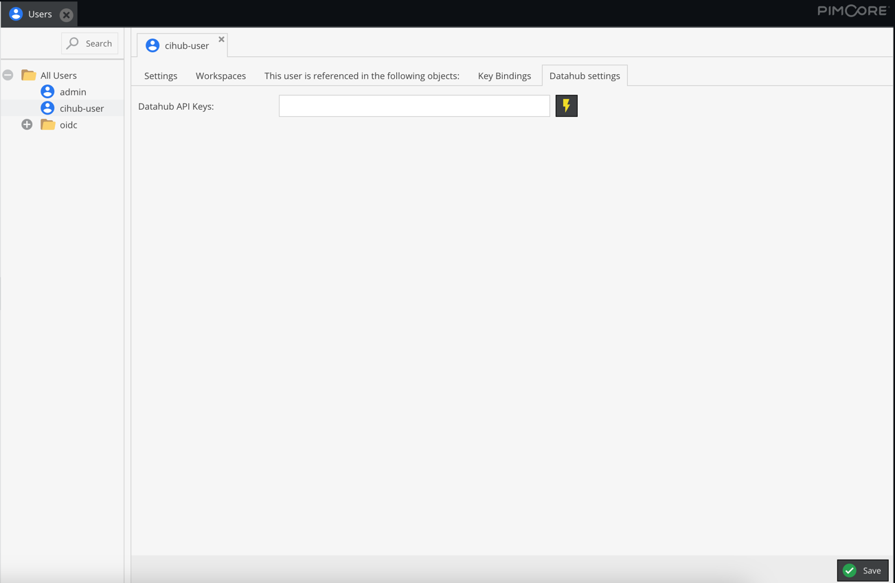

# User authorization
Authorization of users with the Ci-HUB Connector is now done with an individual user token.

The token can be generated both in the user card and in the users admin panel during configuration.

