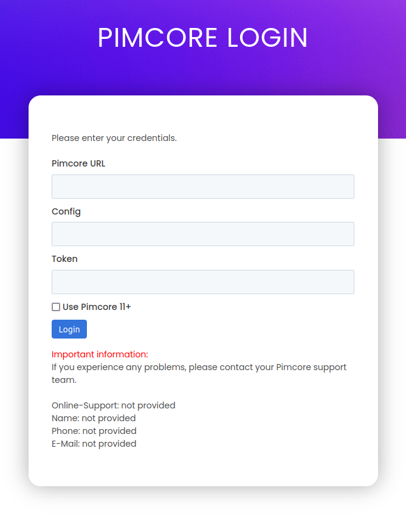

# CI HUB Connector Configuration

1. Install the CI HUB Connector in the products that have [Pimcore integration ](https://ci-hub.com/integration/pimcore).
2. CI HUB will allow you to set up a new connection.
3. On the login page, input:
* Pimcore URL: for example, https://<your-page>/datahub/rest/
* Config: [Configuration name](docs/01-endpoint-configuration.md)  
* Token: [User authorization token](docs/00-user-authorization.md)  

4. The result should be successfully connected to Pimcore.  

